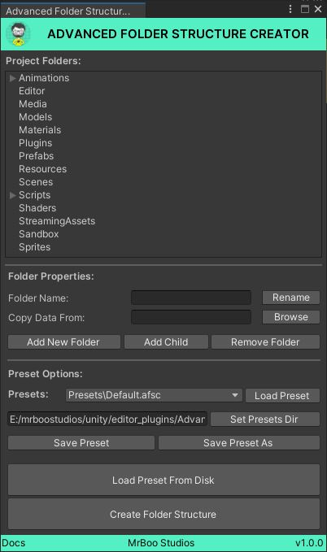
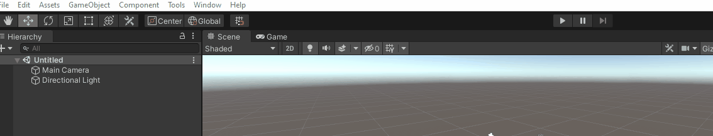
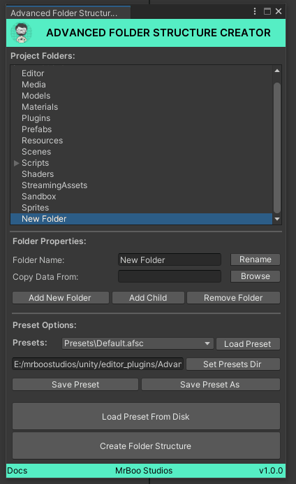
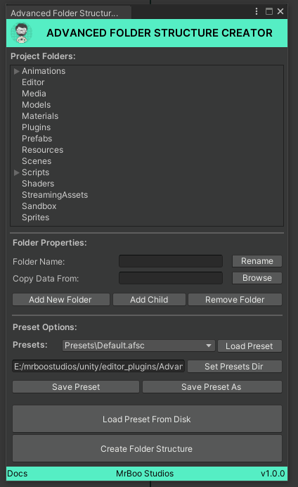
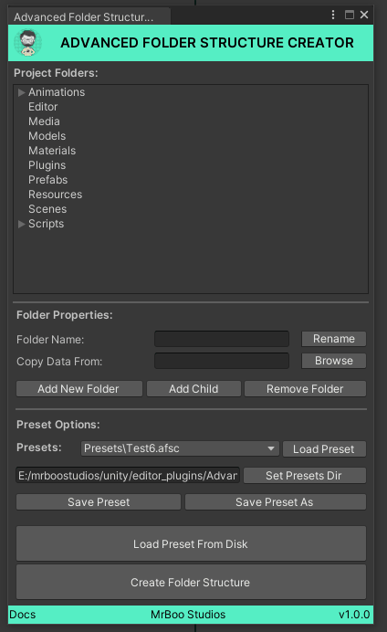
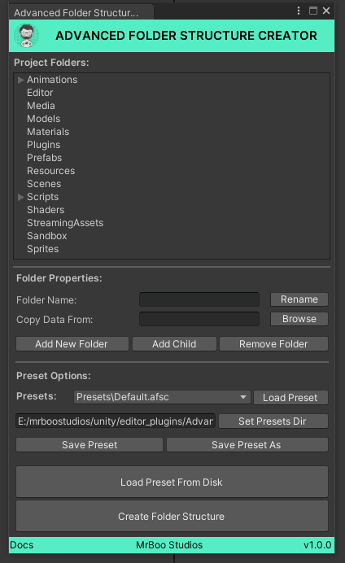
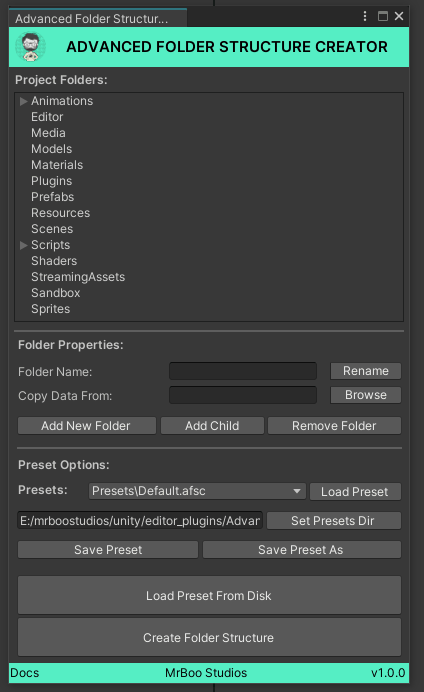
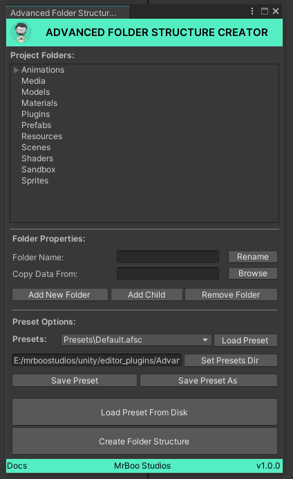
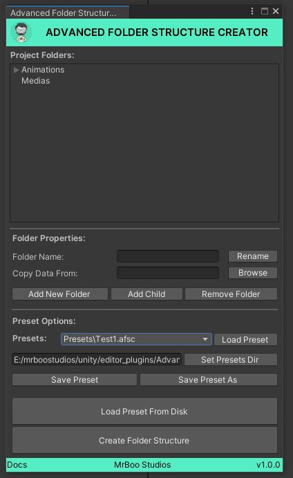
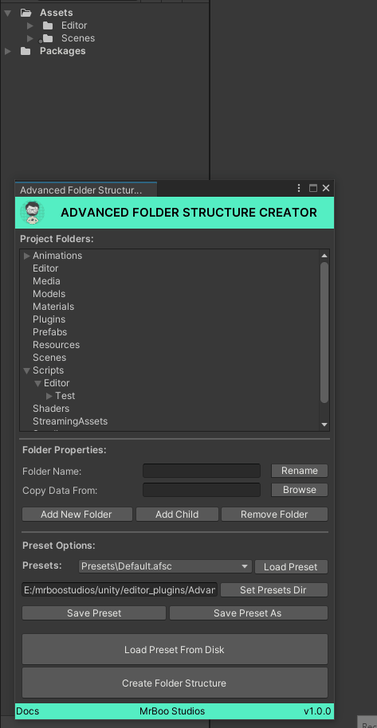

<p align="center">
<a href="https://github.com/mrboostudios/AdvancedFolderStructureCreator" target="_blank">

</a>
<hr>
<p align="center">
</p>


[](https://git.io/typing-svg)
<hr>
 Advanced Folder Structure Creator is an Unity Editor Plugin that can be used for creating consistent and scalable folder structures across different unity projects. The tool allows you  to configure different presets that you can easily use to create different project folder structures for different projects.
</p>

## User Interface
* **Project Folders** - Shows list of all the folder that will be created when clicking **Create Folder Structure Button**
* **Folder Properties** - Options to change the properties of the folder (Ex: **Rename**)
  * Folder Name - Type in the new name for the selected foleder
  * Rename - Clicking will help Rename the selected folder in the tree view
  * Copy Data From - Allows user to choose a folder for copying the data from
  * Add New Folder - Adds new folder to project folders view. This will just add a new folder to top level projects
  * Add Child - Adds a new child folder to the selected folder
  * Remove Folder - Removes the selected folder, if the selected folder contains children will remove that also

* **Preset Options** - Contains options related to folder preset management
  * Presets - List of all the presets will be shown here
  * Load Preset - Load the selected preset from the drop down
  * Set Presets Dir - Sets preset dir, where all the preset will be there. This is a global will be same across all the projects
  * Save Preset - Save the current folder tree view and it's properties as preset
  * Save Preset As - Save the current folder tree view and it's properties as preset and prompts for new games
  * Load Preset From Disk - Loads a preset (.afsc file) from disk
  * Create Folder Structure - Creates the folder strcuture and copies the data if mentioned in the folder
* **Docs** - Takes to the documentation page

## Concepts

### Presets

This tool works basis on the concept of Presets. Preset is nothing but a details of list of folders, it's nested child folder's and it's folder properties stored in a *.afsc file* (nothing but a XML file

#### Sample Preset
```
<AdvancedFolderStructureCreator>
  <Folder name="Animations" copyfrom="">
    <Folder name="2DAnimations" copyfrom="" />
    <Folder name="3DAnimations" copyfrom="" />
  </Folder>
  <Folder name="Media" copyfrom="" />
  <Folder name="Models" copyfrom="" />
  <Folder name="Materials" copyfrom="" />
  <Folder name="Plugins" copyfrom="" />
  <Folder name="Prefabs" copyfrom="" />
  <Folder name="Resources" copyfrom="" />
  <Folder name="Scenes" copyfrom="" />
  <Folder name="Shaders" copyfrom="" />
  <Folder name="StreamingAssets" copyfrom="" />
  <Folder name="Sandbox" copyfrom="" />
  <Folder name="Sprites" copyfrom="" />
</AdvancedFolderStructureCreator>
```

As you can see, each preset contains list of folders and it's properties. One can also create a custom preset without the tool, just copy the above snippet and modify and save it as a new file with *.afsc extension*

### Presets Dir
By setting **Presets Dir** we can tell the tool that it's a dir where all the presets *.afsc files* can be found. Once the **Presets Dir** is set, this will be stored in a global location and will be updated and the presets will be loaded from here irrespective of the project. When you open the tool, all the presets will be loaded by default if presets dir is set previously 


## Workflow

#### Run the tool

1. Launch the tool from Unity Editor > Tools > MrBoo Studios > Advanced Folder Structure Creator



#### Set Presets Dir

1. By setting **Presets Dir** we can tell the tool that it's a dir where all the presets *.afsc files* can be found
2. Click **Set Presets Dir** button, choose the folder
3. All the presets will be loaded from that folder
4. Once set this will be stored and used for loading presets in other projects too



#### Load a Preset

1. Different Presets can be loaded from the Presets dropdown
2. Select a Preset
3. Click **Load Preset** button
4. Selected Preset's data will be loaded and folder tree will be updated



#### Load Presets From Disk

1. In some scenario, you want to load preset from diffrent folders other than the selected **Preset Dirs**
2. In that case you can click **Load Preset From Disk Button**
3. Choose a Preset and Click Open



#### Create New Folders

1. Once the tool is loaded, it will show a list of defaul folders created using the default preset
2. To add a new folder to the list just click **Add New Folder** button under **Folder Properties Options**
3. A Folder will be added to Top-Level tree with the name New Folder
4. You can add as many folders as possible



#### Remove Existing Folders

1. Folders can be easily removed from the hierarchy easilt
2. Select a folder in the tree view and click **Remove Folder** button
3. Removing a folder also remove it's child folders



#### Edit Folder Properties

* Rename
  Folder name can be changed in two ways
  1. Select a folder and type in the name in the **Folder Name** text box and click **Rename** button or
  2. Select a folder and simply press F2 and type in the new name

* Copy Data From
  1. Each folder can be assigned a Copy Data Folder, the data will be copied from the source folder to the selected project folder
  2. To Set Copy Data Folder, Click **Browse Button** & choose a folder
  3. All the folder contents will be copied over and the necessary folders will be created



#### Save New Preset

1. Once we have good project folder hierachy created, we can save it so that we can use that for our future projects
2. Why saving a Preset is important? Because we need to consistent folder structures in all our projects which will definitely benefit us in the long run
3. Click **Save As Preset** button and choose the folder and type in the new name
4. Click **Save** the preset will be saved to the disk



#### Overwrite Exising Preset

1. One can also overwrite the existing preset
2. Just Click **Save Preset** button, that will overwrite the existing preset

#### Create Folder Structure

1. Once you are happy with the folder structure
2. Click **Create Folder Stucture** button
3. Creates all the folders, sub-folders & copy all the relevant data



